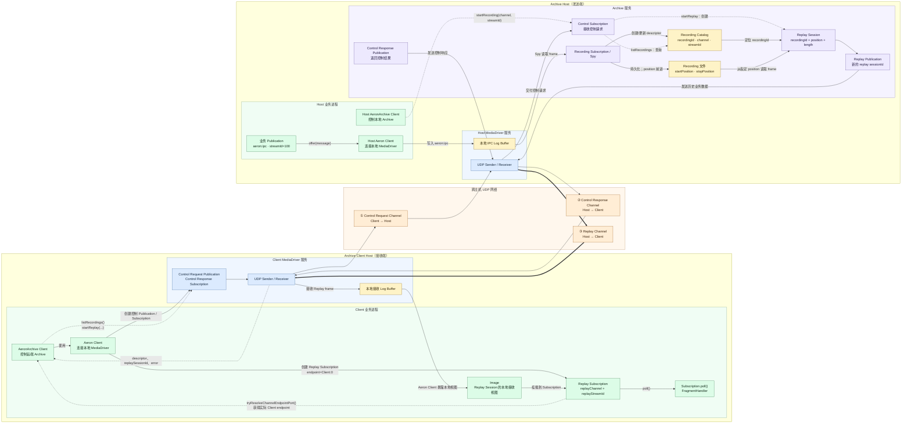
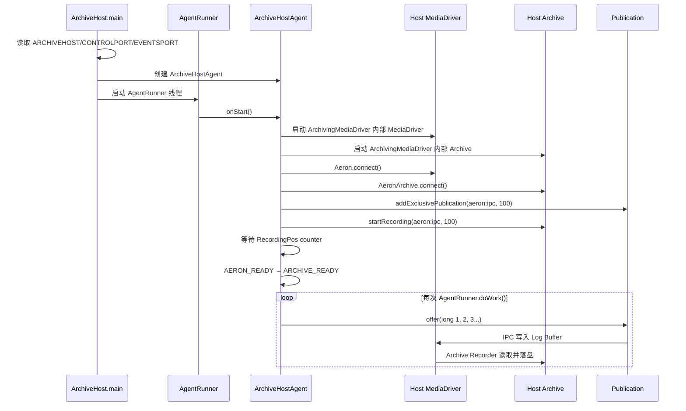
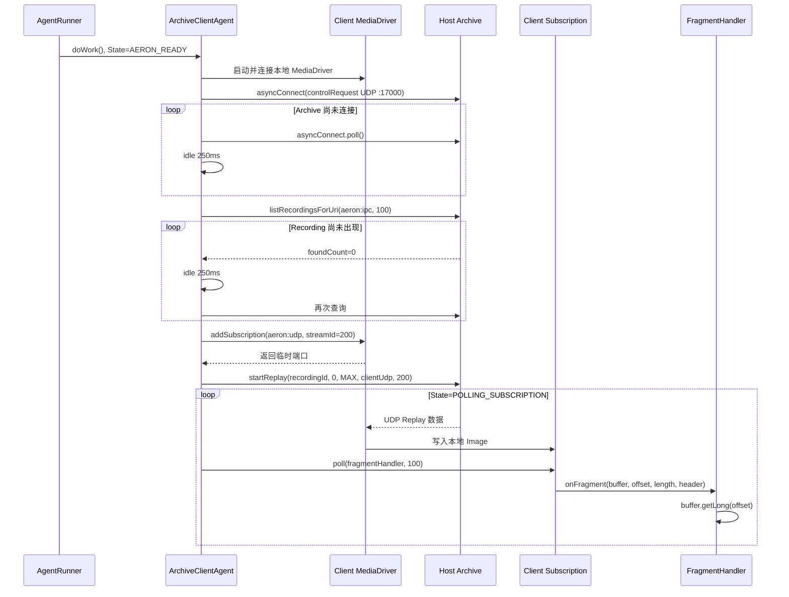

# Aeron 学习笔记（Codex 独立版）

> 本文独立整理自 Aeron 官方文档和当前学习过程，不参考既有 Claude 笔记。
>
> 当前范围：Agrona、Aeron Transport、Aeron Archive Overview 与 Basic Sample。

## 目录

- [一、整体认识](#一整体认识)
- [二、Agrona：低延迟应用的基础工具箱](#二agrona低延迟应用的基础工具箱)
  - [1. Duty Cycle](#1-duty-cycle)
  - [2. Agent](#2-agent)
  - [3. Idle Strategy](#3-idle-strategy)
  - [4. Threads、Agents 与 Duty Cycles](#4-threadsagents-与-duty-cycles)
  - [5. DirectBuffer](#5-directbuffer)
  - [6. RingBuffer](#6-ringbuffer)
  - [7. Agrona 与普通 Java 多线程](#7-agrona-与普通-java-多线程)
- [三、Aeron Transport：实时消息传输](#三aeron-transport实时消息传输)
  - [8. Media Driver](#8-media-driver)
  - [9. Channel、Stream、Session 与 Image](#9-channelstreamsession-与-image)
  - [10. Publication 与 Subscription](#10-publication-与-subscription)
  - [11. 应用消息、Frame、分片与聚合](#11-应用消息frame分片与聚合)
  - [12. Log Buffer、Term 与 Image](#12-log-bufferterm-与-image)
  - [13. Position](#13-position)
  - [14. Aeron 如何在 UDP 上实现可靠传输](#14-aeron-如何在-udp-上实现可靠传输)
  - [15. IPC](#15-ipc)
- [四、Aeron Archive：录制与回放](#四aeron-archive录制与回放)
  - [16. Archive Overview](#16-archive-overview)
  - [17. Basic Sample](#17-basic-sample)
  - [18. Working with Recordings](#18-working-with-recordings)
  - [19. Multi-host Sample：Host 与 Client 的完整数据交换](#19-multi-host-samplehost-与-client-的完整数据交换)
- [五、把全部知识串起来](#五把全部知识串起来)
- [六、易错点速查](#六易错点速查)
- [七、后续学习路线](#七后续学习路线)
- [八、官方资料索引](#八官方资料索引)

---

## 一、整体认识

Aeron 不是传统消息 Broker。它不以队列持久化、消费者组和业务路由为核心，而是专注于低延迟、高吞吐的消息传输。

```text
业务逻辑
  │
  │ Publication / Subscription
  ▼
Aeron Transport
  │ Media Driver、UDP、IPC、Log Buffer
  ▼
Agrona
  Agent、Duty Cycle、Idle Strategy、DirectBuffer、RingBuffer

Aeron Archive = 在 Transport 旁增加持久化录制与回放
Aeron Cluster = 在 Transport + Archive 上增加复制状态机和高可用
```

三者的定位：

| 组件 | 核心职责 |
|------|----------|
| Agrona | 高性能数据结构、内存访问和 Agent 执行模型 |
| Aeron Transport | 通过 UDP 或共享内存传输实时消息 |
| Aeron Archive | 将流录制到持久化存储并按 Position 回放 |

---

## 二、Agrona：低延迟应用的基础工具箱

### 1. Duty Cycle

Duty Cycle 是组件反复执行的主循环，也可以理解为 event loop：

```java
while (running)
{
    int workCount = agent.doWork();
    idleStrategy.idle(workCount);
}
```

它决定两个直接指标：

- 一秒能够处理多少工作，即吞吐量。
- 没有工作时如何等待，即 CPU 消耗和唤醒延迟。

常见类型：

| 类型 | 驱动源 | 典型等待 | 示例 |
|------|--------|----------|------|
| 业务逻辑型 | 输入消息 | 很短或不等待 | 订单处理、消息转发 |
| 连接管理型 | 时间和连接状态 | 可达毫秒或百毫秒 | 重连、连接时间窗检查 |

关键认识：Duty Cycle 不是“线程一直做同一种工作”，而是“一次循环要完成哪些工作，以及没工作时如何退让”。

### 2. Agent

Agent 是封装应用逻辑的可调度组件，核心方法是 `doWork()`：

```java
public int doWork()
{
    int workCount = 0;
    workCount += pollCommands();
    workCount += processTimers();
    return workCount;
}
```

`workCount > 0` 表示本轮做了工作，通常立即开始下一轮；`workCount == 0` 表示暂时空闲，由 Idle Strategy 处理。

Agent 不等于 Thread：

- Agent 描述“做什么”。
- Thread 描述“在哪里运行”。
- 一个 Agent 可以独占线程。
- 多个 Agent 可以组成 `CompositeAgent` 共享线程。
- Agent 也可以由外部通过 `AgentInvoker` 驱动。

设计 Agent 的原则：

1. 不在 Agent 内部随意创建线程或 Executor。
2. 不让其他线程直接修改 Agent 的内部状态。
3. 跨 Agent 通过 RingBuffer、Aeron IPC 或明确的并发结构传递消息。
4. 每次 `doWork()` 应有工作上限，避免一个 Agent 长时间霸占共享线程。

### 3. Idle Strategy

Idle Strategy 把业务逻辑和等待策略分离。Agent 只报告工作量，不决定 `sleep` 多久。

| 策略 | 行为 | 延迟倾向 | CPU 倾向 |
|------|------|----------|----------|
| `NoOpIdleStrategy` | 完全不等待 | 最低 | 最高 |
| `BusySpinIdleStrategy` | `Thread.onSpinWait()` | 极低 | 很高 |
| `YieldingIdleStrategy` | `Thread.yield()` | 低 | 较高 |
| `BackoffIdleStrategy` | spin → yield → park | 平衡 | 自适应 |
| `SleepingIdleStrategy` | `parkNanos` | 较高 | 低 |
| `SleepingMillisIdleStrategy` | 毫秒睡眠 | 高 | 很低 |

`BackoffIdleStrategy` 通常会维护内部退避状态，因此不要默认多个线程可以共享同一个实例。更稳妥的方式是每个被调度的 Agent 使用独立实例。

### 4. Threads、Agents 与 Duty Cycles

Agrona 的思路不是“遇到异步工作就创建线程”，而是把任务纳入已有 Duty Cycle：

```text
普通思路：任务 → Executor → 额外线程 → 共享状态和同步
Agent 思路：任务 → 消息队列 → doWork() 中有界处理
```

同步等待结果时，也常采用带超时的 poll + idle，而不是无限期阻塞。定时任务可以在 Duty Cycle 中检查 Clock，但在 Aeron Cluster 中应使用 Cluster 提供的确定性 Timer，而不是本地墙上时钟调度。

### 5. DirectBuffer

`DirectBuffer` 是 Agrona 的字节读取接口；`MutableDirectBuffer` 增加写入能力；`AtomicBuffer` 再增加原子和有序内存操作。常见实现是 `UnsafeBuffer`。

它解决的是“如何高效操作一块连续字节内存”：

```java
buffer.putInt(offset, orderId);
buffer.putLong(offset + Integer.BYTES, price);

int orderId = buffer.getInt(offset);
long price = buffer.getLong(offset + Integer.BYTES);
```

重要特点：

- 可以包装堆内数组、直接 `ByteBuffer`、内存映射区域等存储。
- 使用显式 offset，不改变类似 NIO `ByteBuffer.position()` 的隐式游标。
- 支持基本类型、字符串、批量字节和原子操作。
- 适合预分配和对象复用，减少热路径分配。

注意：DirectBuffer 不等于“天然零拷贝”。它只是允许直接操作目标内存。是否发生拷贝取决于数据路径：

```text
offer/write：源 Buffer → 目标 Log/Ring Buffer，通常有一次复制
tryClaim：先在目标中占位 → 直接 putInt/putLong，避免中间复制
```

字节序、字段偏移、容量边界和对齐必须由协议双方一致约定。回调里的 `offset` 也不一定是 0。

### 6. RingBuffer

RingBuffer 是建立在 `AtomicBuffer` 上的队列协议：DirectBuffer 提供物理字节存储，RingBuffer 提供消息边界、生产者/消费者 Position 和并发规则。

```text
RingBuffer：逻辑层——claim、commit、read、head/tail、背压
AtomicBuffer：物理层——get/put/CAS/有序写
```

主要类型：

| 类型 | 生产者 | 消费者 |
|------|--------|--------|
| `OneToOneRingBuffer` | 1 | 1 |
| `ManyToOneRingBuffer` | 多个 | 1 |

RingBuffer 创建时容量固定，并需预留 trailer 元数据区域。普通 `write()` 将源 Buffer 的字节复制到内部 Buffer；`tryClaim()` 则直接申请目标区域：

```java
int index = ringBuffer.tryClaim(messageTypeId, messageLength);
if (index > 0)
{
    ringBuffer.buffer().putInt(index, value);
    ringBuffer.commit(index);
}
```

如果空间不足，写入不会无限阻塞，而是失败并把重试、退避或丢弃策略交给应用。这是显式背压。

Broadcast 与 RingBuffer 不同：Broadcast 面向一对多，但慢消费者可能被覆盖，没有 RingBuffer 式背压；要求可靠一对多时通常应考虑 Aeron。

### 7. Agrona 与普通 Java 多线程

| 维度 | 常见 Java 并发模型 | Agrona/Aeron 风格 |
|------|-------------------|-------------------|
| 执行 | 线程池提交任务 | Agent Duty Cycle |
| 等待 | 阻塞、Condition | poll + Idle Strategy |
| 状态 | 多线程共享并加锁 | 状态归单个 Agent 所有 |
| 通信 | 对象引用、BlockingQueue | 预分配 Buffer 和消息传递 |
| 背压 | 阻塞或无界堆积 | 返回状态码，应用显式处理 |
| 目标 | 通用和开发便利 | 可预测低延迟与高吞吐 |

Agrona 并不是“所有 Java 程序都应该这样写”。它用更多 CPU、固定容量和更严格的所有权约束，换取更少的锁竞争、分配和调度抖动。

---

## 三、Aeron Transport：实时消息传输

### 8. Media Driver

Media Driver 是 Aeron 的传输引擎，管理 Publication、Subscription、UDP/IPC 数据流和共享内存资源。它不是保存业务消息的 Broker。

主要工作组件：

| 组件 | 职责 |
|------|------|
| Driver Conductor | 处理客户端命令、资源生命周期、超时和名称解析 |
| Sender | 从 Publication Log Buffer 读取并发送 UDP 数据 |
| Receiver | 接收 UDP 帧、写入 Image、检测 gap、发送 NAK/SM |
| Client Conductor | Aeron Client 内部协调与 Driver 的命令/事件交互 |

Media Driver 目录中的关键内容：

- `cnc.dat`：Client 与 Driver 的命令、事件、Counters 和元数据。
- `publications/`：Publication Log Buffer 文件。
- `images/`：接收端 Image Log Buffer 文件。
- `loss-report.dat`：丢包报告。

线程模式：

| 模式 | Driver 线程组织 | 适用情况 |
|------|----------------|----------|
| `DEDICATED` | Conductor、Sender、Receiver 独立 | 核心充足、低延迟 |
| `SHARED_NETWORK` | Sender + Receiver，共享网络线程；Conductor 独立 | 折中 |
| `SHARED` | 三个 Agent 共享一个线程 | 开发或资源受限 |
| `INVOKER` | Driver 不自行起线程 | 外部事件循环主动驱动 |

### 9. Channel、Stream、Session 与 Image

可以用四层来定位接收到的数据：

```text
Channel  = 传输方式和地址，例如 aeron:udp?endpoint=host:port
Stream   = Channel 上的逻辑主题，由 streamId 区分
Session  = 一个 Publication 数据源的实例身份
Image    = 接收端对该 Session 数据流的本地视图
```

更准确的关系是：

```text
Publication(channel, streamId, sessionId)
                   │
                   │ UDP / IPC
                   ▼
Subscription(channel, streamId)
  ├── Image(sessionId=A)
  └── Image(sessionId=B)
```

一个 Subscription 可同时接收多个 Session，因此内部可能有多个 Image。顺序保证的边界是单个 Image，而不是整个 Subscription：不同 Session 之间没有全序。

类比仅用于辅助：Channel 像路线，Stream 像逻辑车道，Session 像有车牌的运输车辆，Message 像货物，Image 像接收站为某辆车维护的卸货记录。不要把类比当成协议定义。

### 10. Publication 与 Subscription

Publication 用于发送，Subscription 用于接收。

#### Push 与本地 Poll

UDP 单播中，Publication 的 endpoint 通常指向接收端 Subscription 所在地址：

```java
String channel = "aeron:udp?endpoint=receiver-host:40456";
```

网络层是 Push：发送端把数据推向目标地址。`subscription.poll()` 不是去远端 Publication 拉数据，而是读取 Receiver 已经写入本地 Image 的数据。

```text
Publication → UDP Push → Receiver → Image → subscription.poll()
```

#### 线程安全

| 对象 | 线程安全性 | 使用建议 |
|------|------------|----------|
| `ConcurrentPublication` | 支持多线程 offer | 多发送线程共享时使用 |
| `ExclusivePublication` | 非线程安全 | 单发送线程/Agent，性能更高 |
| `Subscription` | 非线程安全 | 由一个线程负责 poll |

“对象线程安全”不等于“handler 可以把回调 Buffer 留到以后使用”。回调中的数据视图通常只在回调期间有效；如需跨线程或长期保存，应复制或在回调内完成解码。

#### 非阻塞发送与返回值

`offer()` 和 `tryClaim()` 都是非阻塞的，成功时返回新的 Position，失败时返回负状态：

| 状态 | 含义 |
|------|------|
| `NOT_CONNECTED` | 尚无可用接收端 |
| `BACK_PRESSURED` | 发送窗口或可用容量不足 |
| `ADMIN_ACTION` | Term 轮转等管理动作，通常稍后重试 |
| `CLOSED` | Publication 已关闭 |
| `MAX_POSITION_EXCEEDED` | 到达该 Publication 的最大 Position |

不要把所有负值都写成无限重试；关闭和最大 Position 属于终止条件，连接与背压则应有明确的 Idle、超时或丢弃策略。

### 11. 应用消息、Frame、分片与聚合

一次 `offer()` 表达一条应用消息，但网络上的 Aeron Data Frame 与应用消息不一定一一对应。

- 消息不超过 `maxPayloadLength()`：通常一个 Data Frame 即可承载。
- 消息超过 `maxPayloadLength()`：Aeron 自动拆成多个 Fragment/Data Frame。
- Receiver/Driver 一次 UDP send 可能发送一个包含多帧的 datagram，但不会为了凑满 MTU 人为等待。
- 来自不同 Publication/Session 的数据不会混成同一条有序流。

接收大消息时可使用 `FragmentAssembler`：

```java
FragmentAssembler assembler = new FragmentAssembler(
    (buffer, offset, length, header) -> onCompleteMessage(buffer, offset, length));

subscription.poll(assembler, fragmentLimit);
```

`poll()` 返回的是读取的 Fragment 数，不一定等于完整应用消息数。

Log Buffer 的基本记录单位是 Frame。Data Frame 有协议头、Payload，并按 Frame Alignment 对齐。一个很小的应用消息也会有 Header 和 Padding 开销。

### 12. Log Buffer、Term 与 Image

每个 Publication 在发送端拥有自己的 Log Buffer；不是每次 `offer()` 分配一个 Log Buffer。一个 Log Buffer 包含三个等长 Term 分区和一个 Metadata 区：

```text
┌────────────┬────────────┬────────────┬──────────┐
│ Term A     │ Term B     │ Term C     │ Metadata │
└────────────┴────────────┴────────────┴──────────┘
```

多次 `offer()` 会在当前 Term 内连续追加 Frame。Term 写到末尾后轮转到下一个分区。三个物理分区会反复复用，但逻辑 `termId` 持续推进。

常用的 Clean/Active/Dirty 是帮助理解轮转的逻辑状态：

- Active：当前正在追加数据。
- Dirty：保留了上一轮数据、尚待清理和复用。
- Clean：已经清零，可供未来轮转使用。

需要纠正一个过度简化：不要把 Dirty → Clean 直接理解成“收到某个 SM 后，Sender 按确认逐 Term 清理”。Aeron 的发送 Log Buffer 由 Term rotation/cleaning 机制管理；流控 Position 保证生产者不会覆盖仍可能被发送或重传的数据。NAK 负责指出缺口，SM 负责接收窗口和进度，二者共同约束数据生命周期，但不是“SM 直接调用 clean(term)”这么简单。

接收端的 Image 也使用对应的 Log Buffer 视图。UDP 乱序到达时，Receiver 根据帧中的 `termId` 和 `termOffset` 写入正确位置。

接收进度：

- `rcv-hwm`：已观察到的最远位置，之前可能有 gap。
- `rcv-pos`：已连续重建完成的位置。
- `sub-pos`：应用实际消费到的位置。

只有连续区域才能安全交给 Subscription 消费。

### 13. Position

Position 是一个 Session 流中的逻辑字节坐标，跨三个物理 Term 单调推进。它用于描述发布、发送、接收、消费和回放进度。

概念公式：

```text
termCount = termId - initialTermId
position  = termCount × termLength + termOffset
```

实现中因为 `termLength` 是 2 的幂，乘法可通过位移完成：

```text
position = (termCount << positionBitsToShift) + termOffset
```

Position 计算的是 Frame 占用的对齐字节，包括协议头和 Padding，不等于业务 Payload 总字节数。

关键 Counter：

| Counter | 含义 |
|---------|------|
| `pub-pos` | 应用成功发布到的位置 |
| `pub-lmt` | 应用当前允许发布到的上限 |
| `snd-pos` | Sender 已发送到的位置 |
| `snd-lmt` | Sender 依据流控可发送到的上限 |
| `rcv-hwm` | Receiver 看到的最高位置 |
| `rcv-pos` | Receiver 连续完成的位置 |
| `sub-pos` | Subscription 消费位置 |

Position 有上限，不是数学意义的无限增长。同一个 Publication 到达最大 Position 后会返回 `MAX_POSITION_EXCEEDED`，需要重新建立新的 Publication/Session。Term 越大，可用 Position 空间越大。

### 14. Aeron 如何在 UDP 上实现可靠传输

UDP 本身不保证送达、顺序或重传。Aeron 在 UDP 之上使用自己的协议机制：

1. Data Frame 携带 Session、Stream、Term 和 Offset 信息。
2. Receiver 将乱序帧放入 Image 的正确位置。
3. Receiver 发现 gap 后发送 NAK，要求重传缺失范围。
4. Sender 从仍保留在 Log Buffer 中的数据重传。
5. Receiver 发送 Status Message，通告接收窗口和进度。
6. Sender 根据 Flow Control Strategy 聚合一个或多个接收端的反馈，计算发送上限。
7. Heartbeat 和超时用于活性检测。

ACK 与 NAK 的取舍：

| 机制 | 正常路径 | 优点 | 风险/代价 |
|------|----------|------|-----------|
| ACK | 确认已收到的数据 | 明确知道交付进度 | 回程控制流量更多 |
| NAK | 只报告缺失范围 | 低丢包环境正常路径开销低 | 需要 gap 检测和抑制重复 NAK |

Aeron 的 NAK 是 Aeron 协议层的控制帧，建立在 UDP 之上，可以视为应用/用户态传输协议的一部分。但 Aeron 不是“只有 NAK”：SM、流控、心跳、Position 和重传缓存缺一不可。

也不要简单宣称 TCP 一定“每包一个 ACK”或 Aeron 一定没有头阻塞。TCP 会使用累计 ACK、延迟 ACK 和 SACK；而 Aeron 为保证单个 Image 的有序交付，中间 gap 仍会阻止 `rcv-pos` 跨过缺口。Aeron 的优势在于其用户态、消息边界明确、可配置且适配低延迟场景的设计。

### 15. IPC

`aeron:ipc` 用于共享同一 Media Driver 的本机客户端。Publication 和 Subscription 通过共享 Log Buffer 协作，省去 UDP 网络路径：

```text
UDP：Publication Log → Sender → UDP → Receiver → Image → Subscription
IPC：Publication Log ─────────────────────────────→ Subscription/Image 视图
```

IPC 仍保留 Aeron 的统一 API、Position、背压、Counters 和多订阅能力。裸 `OneToOneRingBuffer` 往往更轻，但只提供更窄的同进程队列语义；选择 Aeron IPC 的价值在于统一传输模型、跨进程支持和可观测性。

性能数字必须当作特定硬件、JVM、消息大小、线程模式和 Idle Strategy 下的样例，不应直接作为自己的容量结论。应在目标机器上使用真实消息大小和拓扑做基准测试。

---

## 四、Aeron Archive：录制与回放

### 16. Archive Overview

Aeron Archive 把 Aeron 流录制到持久化存储，并可从指定 Position 回放。它不是另一个通用 Broker，而是 Transport 数据流的持久化扩展。

```text
实时 Publication
       │
       ├──────────────→ 实时 Subscription
       │
       └→ Archive Recording → Segment Files
                                  │
                                  └→ Replay Publication → Replay Subscription
```

主要能力：

- 开始、停止和扩展 Recording。
- 查询 Recording Descriptor。
- 从指定 Position 和长度开始 Replay。
- 将历史回放与实时流合并。
- 截断尾部、清理旧 Segment。
- 在 Archive 之间复制 Recording。

核心对象：

| 对象 | 含义 |
|------|------|
| `Archive` | 录制、磁盘 I/O、回放服务端 |
| `AeronArchive` | 应用使用的 Archive Client API |
| Recording | 某条 Session 流在磁盘上的持久化记录 |
| Recording Descriptor | Recording 的 ID、Channel、Stream、Session、Position 和时间信息 |
| Segment File | Recording 在磁盘上的分段文件 |
| Replay Session | Archive 从磁盘读取并通过新 Publication 发送的会话 |

Archive 的控制与数据平面分开：

- Control Request：Client 向 Archive 发命令。
- Control Response：Archive 返回命令结果。
- Recording Events：发布录制进度事件。
- Replay Channel：传输真正的回放数据。

跨主机 Replay 必须使用 UDP；只有双方共享同一个 Media Driver 时，Replay Channel 才能使用 IPC。

### 17. Basic Sample

Basic Sample 的主流程：

```text
setup → startRecording → create Publication → offer messages
      → wait Recording Position → find recordingId
      → startReplay → create replay Subscription → poll → cleanup
```

#### 17.1 启动 ArchivingMediaDriver

`ArchivingMediaDriver` 组合 Media Driver 与 Archive，适合样例和同机部署。测试配置通常删除旧目录，并启用 `spiesSimulateConnection(true)`。

`spiesSimulateConnection` 的意义是：本地 Spy Subscription 可以让 Publication 被视为 connected，即便没有普通订阅者。这适合“只录制、暂时没人实时消费”的场景，但应明确它会改变 Publication 的连接判定语义。

#### 17.2 开始录制后再发布

```java
aeronArchive.startRecording(channel, captureStreamId, SourceLocation.LOCAL);
ExclusivePublication publication = aeron.addExclusivePublication(channel, captureStreamId);
```

`SourceLocation.LOCAL` 表示 Archive 通过本地 Spy 观察 Publication；`REMOTE` 则表示 Archive 像普通远端接收者一样订阅网络流。

#### 17.3 offer 成功不代表已经落盘

`publication.offer()` 成功只意味着数据进入 Publication Log Buffer。Archive 是异步录制者，因此程序若要安全结束，需要等待 Recording Position Counter 追上 Publication Position：

```text
publication.position()       = 应用发布到哪里
RecordingPos counter value  = Archive 持久化到哪里

RecordingPos >= publication.position() → 本批数据已被录制到目标位置
```

这是一条非常重要的边界：Transport 接受、Archive 读取、操作系统缓存和物理介质持久化并不是同一个同步时刻。对严格耐久性要求，还需结合 Archive 的同步级别配置理解落盘语义。

#### 17.4 查询 Recording

`listRecordingsForUri()` 通过 `RecordingDescriptorConsumer` 返回描述信息，包括：

- `recordingId`
- `startPosition` / `stopPosition`
- `initialTermId`、Term/Segment/MTU 长度
- `sessionId` / `streamId`
- 原始 Channel、剥离后的 Channel、来源身份

样例取最后回调到的 `recordingId` 作为最新 Recording。生产代码应明确分页、过滤条件和“最新”的排序语义，而不是隐式依赖小样本。

#### 17.5 启动 Replay

```java
long replaySessionId = archive.startReplay(
    recordingId,
    startPosition,
    replayLength,
    replayChannel,
    replayStreamId);
```

Archive 从 Segment 读取 Frame，创建 Replay Publication，把数据推送到指定 Channel。Client 创建 Subscription 并使用返回的 replay session ID 过滤目标回放，避免同一 Channel/Stream 上其他 Session 的干扰。

应区分两个概念：

- 有界 Replay：指定固定 `length`，到达范围末尾后结束。
- 持续跟随/Live Replay：希望回放追随仍在增长的 Recording，通常需要使用相应 Replay 参数或 `ReplayMerge` 模式。不能仅凭 `Long.MAX_VALUE` 就把所有场景概括为“自动无缝切实时流”；是否跟随活动录制以及如何切换到独立 live destination，要看具体 API 和拓扑。

#### 17.6 资源关闭

应先停止上层客户端和会话，再关闭 Aeron Client，最后关闭 Archive/Media Driver 容器。使用 try-with-resources 或 `CloseHelper`，并确保异常路径也能释放 Replay、Subscription 和 Publication。

### 18. Working with Recordings

这一章解决的不是“如何录制”，而是录制完成或正在进行时，应用如何回答三个问题：

1. Archive 里有哪些 Recording，我要操作哪一个？
2. 这个 Recording 当前有哪些数据可以回放？
3. 控制请求是否失败，如何及时发现？

可以把 Recording 看成 Archive Catalog 中的一条持久化流记录，而 `recordingId` 是后续查询 Position、Replay、Truncate、Purge 和 Replicate 的主键。

#### 18.1 查询 Recording Descriptor

`listRecordings()` 从指定 `recordingId` 起点开始，最多返回 `recordCount` 条记录。每一条通过 `RecordingDescriptorConsumer` 回调交给应用：

```java
int found = archive.listRecordings(
    fromRecordingId,
    recordCount,
    (controlSessionId, correlationId, recordingId,
     startTimestamp, stopTimestamp,
     startPosition, stopPosition,
     initialTermId, segmentFileLength,
     termBufferLength, mtuLength,
     sessionId, streamId,
     strippedChannel, originalChannel, sourceIdentity) ->
    {
        // 保存或处理 descriptor
    });
```

Descriptor 字段可分为四组：

| 分组 | 字段 | 用途 |
|------|------|------|
| 身份 | `recordingId`、`sessionId`、`streamId` | 找到目标录制及其原始数据流 |
| 时间与范围 | `startTimestamp`、`stopTimestamp`、`startPosition`、`stopPosition` | 判断生命周期和可回放区间 |
| 存储/协议布局 | `initialTermId`、`segmentFileLength`、`termBufferLength`、`mtuLength` | 定位 Segment、验证兼容性 |
| 来源 | `strippedChannel`、`originalChannel`、`sourceIdentity` | 判断原始 Channel 和来源类型 |

通常业务最常用的是 `recordingId + channel + streamId`，但如果同一 Channel/Stream 曾经产生多个 Session，就不能只凭 Channel/Stream 假设 Recording 唯一。

`fromRecordingId` 和 `recordCount` 用于分页。稳妥做法是记录本页最后一个实际返回的 ID，下一页从 `lastRecordingId + 1` 开始，而不是假设 Recording ID 必然连续或固定加一个页面大小。

#### 18.2 按 URI 和 Stream 筛选

```java
int found = archive.listRecordingsForUri(
    fromRecordingId,
    recordCount,
    channelFragment,
    streamId,
    descriptorConsumer);
```

这个方法筛选两项：

- Recording 的 Channel 包含传入的文本片段。
- `streamId` 完全匹配。

“URI 匹配”是 Channel 文本包含匹配，不是完整 URI 对象的语义等价比较。因此筛选片段应足够具体；如果 endpoint、tag 或其他参数过于宽泛，可能返回多个 Recording，最终仍要检查 Descriptor。

#### 18.3 三种 Position 不可混淆

```java
long recordingPosition = archive.getRecordingPosition(recordingId);
long startPosition = archive.getStartPosition(recordingId);
long stopPosition = archive.getStopPosition(recordingId);
```

| API | Recording 活跃时 | Recording 停止后 | 含义 |
|-----|------------------|-------------------|------|
| `getStartPosition()` | 固定起点 | 固定起点 | 当前仍保留数据的最早 Position |
| `getRecordingPosition()` | 当前录制进度 | `NULL_POSITION` | 只表示活跃 Recording 的实时进度 |
| `getStopPosition()` | `NULL_POSITION` | 固定终点 | 只在 Recording 停止后确定 |

最容易犯的错误是把 `getRecordingPosition() == NULL_POSITION` 理解成 Recording 不存在。文档这里的语义是：Recording 存在，但当前不活跃。不存在或请求失败还需要结合 Archive 的响应/错误处理判断。

Position 区间可这样理解：

```text
活跃 Recording： [startPosition, recordingPosition)
停止 Recording： [startPosition, stopPosition)
```

用左闭右开区间理解最实用：起点可以作为 Replay 起点；终点表示“下一字节位置”，在终点开始没有数据可回放。

#### 18.4 Replay 前的边界检查

对于活跃 Recording：

```text
startPosition ≤ requestedStart < recordingPosition
```

如果请求起点已经超过当前 `recordingPosition`，数据还没有录到那里，而且可能永远不会到达。

对于停止 Recording：

```text
startPosition ≤ requestedStart < stopPosition
```

如果 `requestedStart >= stopPosition`，请求范围没有可回放数据，Archive 会报告错误。

实际 Replay 还要检查请求长度：

```text
requestedLength > 0
requestedStart + requestedLength 不应发生 long 溢出
有界回放范围应与可用区间相交
```

这些查询是“查询时刻”的快照。活跃 Recording 的 Position 会继续变化，因此检查之后仍要正确处理 Replay 请求返回的错误，不能把预检查当成原子事务。

#### 18.5 为什么先创建 Subscription 可能泄漏

有些流程会先创建 Replay Subscription，再查询 Recording Position。如果查询后发现请求根本无法执行，必须关闭已经创建的 Subscription：

```java
Subscription subscription = aeron.addSubscription(replayChannel, replayStreamId);
try
{
    // 查询 Position，决定是否 startReplay
}
finally
{
    subscription.close();
}
```

Subscription 不只是普通 Java 对象，它会在 Client/Media Driver 中注册资源和 Counter。遗漏关闭会造成资源泄漏。更简单的设计通常是：先完成 Recording/Position 校验，再创建 Replay 所需资源；如果拓扑要求先建 Subscription，则必须覆盖失败分支的关闭逻辑。

#### 18.6 两种错误检查方式

`pollForErrorResponse()` 返回错误文本，不主动抛异常：

```java
String error = archive.pollForErrorResponse();
if (error != null)
{
    // "not connected" 或 Archive 返回的错误消息
}
```

它适合在某次 `replay`、`replicate` 等请求之后主动检查，或在 Agent Duty Cycle 中把错误转成自己的状态机事件。

`checkForErrorResponse()` 的目的类似，但发现错误时会调用已配置的 `ErrorHandler`；没有配置 Handler 时则抛出异常。两者差别主要是错误交付方式：

| 方法 | 没有错误 | 有错误 |
|------|----------|--------|
| `pollForErrorResponse()` | 返回 `null` | 返回字符串，由调用方决定 |
| `checkForErrorResponse()` | 正常返回 | 调用 `ErrorHandler` 或抛异常 |

它们不是某个异步请求的完整业务响应对象。对于需要严格关联请求与结果的逻辑，仍应使用 Archive API 的 correlation/control session 机制和相应返回语义。

#### 18.7 推荐的安全工作流

```text
1. listRecordings / listRecordingsForUri
   ↓ 找到并核验 Recording Descriptor
2. getStartPosition + getRecordingPosition/getStopPosition
   ↓ 判断活跃状态和可用区间
3. 校验 requestedStart/requestedLength
   ↓
4. 创建 Replay Subscription，并发起 startReplay
   ↓
5. poll 数据，同时检查连接状态和 Archive 错误
   ↓
6. 成功、失败、超时三条路径都关闭 Replay/Subscription
```

这一章的核心不是记住几个查询方法，而是理解：Archive 控制是异步分布式交互，Descriptor 用于确定身份，Position 用于证明数据范围，错误检查用于处理查询与执行之间仍可能发生的状态变化。

---

### 19. Multi-host Sample：Host 与 Client 的完整数据交换

本节对应仓库中的 `archive-multi-host` 示例。Host 同时模拟消息生产者并持有 `ArchivingMediaDriver`；Client 启动自己的 `MediaDriver`，远程连接 Host 的 Archive 并请求回放。

#### 19.1 组件与职责

```text
archive-host（10.1.0.2）
  ArchiveHost.main → AgentRunner → ArchiveHostAgent
    ├─ ArchivingMediaDriver = MediaDriver + Archive
    ├─ Aeron Client
    ├─ Publication: aeron:ipc, streamId=100
    └─ RecordingSignalAdapter / RecordingEventsAdapter

archive-client（10.1.0.3）
  ArchiveClient.main → AgentRunner → ArchiveClientAgent
    ├─ 独立 MediaDriver
    ├─ Aeron Client + AeronArchive Client
    ├─ Replay Subscription: aeron:udp, streamId=200
    └─ ArchiveClientFragmentHandler
```

| 角色 | 职责 |
|------|------|
| `MediaDriver` | 负责 Publication、Subscription、IPC、UDP、Log Buffer 和网络收发 |
| `Aeron` | 应用访问本地 Media Driver 的客户端对象 |
| `Archive` | 负责录制、持久化、查询 Recording 和 Replay |
| `AeronArchive` | 应用访问 Archive 的控制客户端 |
| `Publication` | 发布消息 |
| `Subscription` | 从本地 Media Driver 读取消息 |
| `Agent` | 在 `AgentRunner` 的 Duty Cycle 中驱动状态机 |

这里必须区分服务组件与客户端对象：

| 运行角色 | 本质 | Multi-host 中位于哪里 |
|----------|------|------------------------|
| `MediaDriver` | 真正执行 IPC/UDP 传输的运行时服务 | Host 与 Client 各一个 |
| `Archive` | 真正执行录制、Catalog、磁盘 I/O 和 Replay 的服务 | 只在 Archive Host |
| `Aeron` | 应用访问本地 Media Driver 的客户端对象 | Host 与 Client 业务进程中都有 |
| `AeronArchive` | 应用控制 Archive 的客户端对象 | Host 可控制本地 Archive；Client 控制远端 Archive |

`AeronArchive` 不是 Archive 服务，Replay 业务数据也不经过它。它使用 `Aeron` 和本地 Media Driver 发送控制请求、接收控制响应。真正的 Replay 数据由 Archive 创建的 Replay Publication 发送给 Client Subscription。

#### 19.2 完整数据交换图



通道边界：

```text
Host Publication → Host MediaDriver → Host Archive：aeron:ipc
Client AeronArchive → Client MediaDriver → Host MediaDriver → Host Archive：aeron:udp 控制请求
Host Archive → Host MediaDriver → Client MediaDriver → Client AeronArchive：aeron:udp 控制响应
Host Archive → Host MediaDriver → Client MediaDriver → Image → Subscription.poll()：aeron:udp Replay
```

`aeron:ipc` 只在 Host 容器内部有效，因为 Publication 和 Archive 共享 Host 的 Media Driver；两个容器各自拥有独立的 Media Driver，跨容器必须使用 UDP。

两个 Media Driver 会直接通过 UDP 交换 Aeron 数据包，但不会同步彼此的内部状态。三条跨主机路径都是：

```text
Control Request： Client AeronArchive → Client MediaDriver → Host MediaDriver → Archive
Control Response：Archive → Host MediaDriver → Client MediaDriver → Client AeronArchive
Replay Data：     Archive → Host MediaDriver → Client MediaDriver → Image → Subscription.poll()
```

如果不同进程连接同一个 Media Driver，它们仍可使用 `aeron:ipc`；如果连接不同 Media Driver，即使位于同一台机器，也必须使用 UDP 等网络通道跨 Driver 传输，不存在“同步两个 Media Driver”的过程。

#### 19.3 Channel、Stream、Session 和 RecordingId

Host 创建 Publication：

```java
publication = aeron.addExclusivePublication("aeron:ipc", 100);
archive.startRecording("aeron:ipc", 100, SourceLocation.LOCAL);
```

```text
channel   = aeron:ipc
streamId  = 100
sessionId = MediaDriver 为该 Publication 动态生成
recordingId = Archive Catalog 中这条持久化 Recording 的主键
```

Client 的 Replay 使用独立的逻辑流：

```text
channel  = aeron:udp?endpoint=10.1.0.3:临时端口
streamId = 200
sessionId = Replay 时由 MediaDriver/Archive 动态生成
```

| ID | 含义 |
|----|------|
| `streamId` | 逻辑消息流编号，本例 Host=100、Replay=200 |
| `sessionId` | 某个 Publication 或 Replay 会话的身份 |
| `counterId` | Aeron Counters 区域中的计数器槽位 |
| `recordingId` | Archive Catalog 中一条持久化 Recording 的主键 |

#### 19.4 Host 录制流程



`startRecording()` 是异步控制操作，所以 Host 等待录制会话真正建立：

```java
while (counterId == CountersReader.NULL_COUNTER_ID)
{
    idleStrategy.idle();
    counterId = RecordingPos.findCounterIdBySession(...);
}
```

这个循环等待 Archive 发现 Publication、建立录制会话并创建 `RecordingPos` counter。找到后才能读取录制进度和 `recordingId`。

#### 19.5 Client 连接和 Replay 流程



Client 使用三个 Archive 控制方向：

```java
.controlRequestChannel("aeron:udp?endpoint=10.1.0.2:17000")
.recordingEventsChannel("aeron:udp?endpoint=10.1.0.2:17001")
.controlResponseChannel("aeron:udp?endpoint=10.1.0.3:0")
```

| Channel | 方向 | 用途 |
|---------|------|------|
| Control Request | Client → Host | 连接、查询 Recording、启动 Replay |
| Control Response | Host → Client | 返回控制命令结果 |
| Recording Events | Host → Client | 通知录制开始、进度和停止 |
| Replay Destination | Host → Client | 发送真正的录制数据 |

普通单播 UDP Channel 可以用一条稳定规则理解：`endpoint` 是接收者绑定的地址。

```text
Control Request endpoint  = Archive Host 地址，因为 Host 接收控制请求
Control Response endpoint = Client 地址，因为 Client 接收控制响应
Replay endpoint           = Client 地址，因为 Client 接收 Replay 数据
```

Archive Host 地址已经通过 `controlRequestChannel` 确定。`startReplay()` 不需要再次传入 Host 地址；它需要的是 Replay 的接收地址。

找到 Recording 后，Client 创建：

```java
Subscription subscription = aeron.addSubscription(
    "aeron:udp?endpoint=10.1.0.3:0", 200);
```

Host Archive 到 Client MediaDriver 的 Replay 使用 UDP；Client Agent 通过 `subscription.poll()` 读取已经到达本地 MediaDriver 的 fragment。`poll()` 不会主动向远程 Archive 请求数据。

`startReplay()` 的参数可以这样记：

| 参数 | 含义 | 谁决定 |
|------|------|--------|
| `recordingId` | Archive Catalog 中“播放哪条 Recording” | Client 查询并选择 |
| `position` | 从 Recording 的哪个 Aeron 字节位置开始 | Client |
| `length` | 最多回放多少字节 | Client |
| `replayChannel` | 接收 Replay 的 Client Subscription 实际地址 | Client 创建 Subscription 并解析端口 |
| `replayStreamId` | 本次 Replay Publication/Subscription 使用的逻辑流 | Client 选择，必须与 Subscription 一致 |

使用临时端口时，必须先创建 Subscription，再把解析后的实际地址交给 Archive：

```java
Subscription subscription = aeron.addSubscription(
    "aeron:udp?endpoint=10.1.0.3:0", 200);

String actualReplayChannel = subscription.tryResolveChannelEndpointPort();

archiveClient.startReplay(
    recordingId,
    position,
    length,
    actualReplayChannel,
    200);
```

不能把端口 `0` 直接作为最终 Replay 目标发给 Archive，因为 `0` 只是让 Client 操作系统选择端口的绑定请求；Archive 必须得到最终可发送的实际端口。

Replay 同时具有“推送”和“轮询”两层语义：

```text
网络层：Archive Replay Session → Replay Publication → 两端 Media Driver
        Host 在流量控制允许的范围内主动发送，是 Push

应用层：Subscription.poll() → Client 本地 Image/Log Buffer
        应用主动执行非阻塞本地读取，是 Poll
```

`Subscription.poll()` 不会为每条消息向 Host 发网络读取请求。Client Media Driver 在自己的 Duty Cycle 中异步接收 UDP frame 并写入本地 Image；应用的 Duty Cycle 再反复调用 `poll()` 消费。若应用长期不 poll，消费 Position 不前进，接收窗口最终限制 Host 的 Replay Publication，形成背压。

#### 19.6 所有循环与状态转换

```text
Host AgentRunner
  while（进程运行）→ ArchiveHostAgent.doWork()
    ├─ AERON_READY：创建 Archive、Publication、开始录制
    └─ ARCHIVE_READY：按时间 publication.offer()

Host 录制初始化
  while（RecordingPos counter 尚未创建）
    └─ idle + 重新查找 counter

Client Archive 连接
  AgentRunner 反复执行 asyncConnect.poll()，直到 archive 非 null

Client Recording 查询
  AgentRunner 反复 listRecordingsForUri()，直到找到 recordingId

Client Replay 消费
  State=POLLING_SUBSCRIPTION 时反复执行 subscription.poll(fragmentHandler, 100)
```

所有这些循环都由 Agrona `AgentRunner` 的 Duty Cycle 驱动，业务代码通常不再创建额外线程；`IdleStrategy` 只负责无工作时退让。

#### 19.7 从生产到消费的一句话路径

```text
ArchiveHostAgent
  → Aeron Publication
  → Host MediaDriver
  → IPC
  → Host Archive Recorder
  → Archive Segment 文件
  → Host Archive Replayer
  → UDP
  → Client MediaDriver
  → Client Subscription.poll()
  → ArchiveClientFragmentHandler
```

## 五、把全部知识串起来

| Agrona/Aeron 概念 | 在系统中的实际角色 |
|-------------------|--------------------|
| Duty Cycle | Driver、Archive 和业务 Agent 的执行节奏 |
| Agent | Conductor、Sender、Receiver 等逻辑组件 |
| Idle Strategy | 决定没有工作时的 CPU/延迟取舍 |
| DirectBuffer | Frame 和业务字段的字节级访问接口 |
| RingBuffer | Client/Driver 命令通道等并发消息结构 |
| Publication | 应用向 Log Buffer 追加消息 |
| Sender | 把 Log Buffer 数据发送为 UDP |
| Receiver | 把 UDP 数据重建到 Image |
| Subscription | 应用从本地 Image poll Fragment |
| Session | 区分同一 Channel/Stream 上的不同数据源 |
| Image | 接收端针对一个 Session 的本地数据视图 |
| Position | 贯穿发布、发送、接收、消费、录制和回放的坐标 |
| Archive Recording | 将 Session 流按 Position 保存到 Segment |
| Replay | 从 Recording 读取并创建新的 Publication 数据流 |

端到端路径：

```text
业务对象
  ↓ 编码到 DirectBuffer
Publication.offer / tryClaim
  ↓
Publication Log Buffer（三个 Term 轮转）
  ├─ IPC ───────────────────────────────────────┐
  ├─ Sender → UDP → Receiver → Image ──────────┤
  └─ Archive Recording → Segment → Replay Pub ─┤
                                                ↓
                                      Subscription.poll
                                                ↓
                                          业务 Handler
```

真正贯穿所有层的不是某个 Java 对象，而是以下三个不变量：

1. 消息属于确定的 Channel、Stream 和 Session。
2. Frame 在该 Session 中具有确定的 Position。
3. 生产、发送、接收、消费、录制和回放都通过比较 Position 协调进度。

---

## 六、易错点速查

| 常见说法 | 更准确的理解 |
|----------|--------------|
| Agent 就是 Thread | Agent 是逻辑组件，可独占、共享或被外部调用 |
| DirectBuffer 就是零拷贝 | 是否零拷贝取决于是否直接写目标区域，例如 tryClaim |
| 每次 offer 一个 Log Buffer | 每个 Publication 使用一个 Log Buffer，多次 offer 追加 Frame |
| Session 可以横跨多个 Stream | Session 是 Publication 数据流身份，定位时始终与 Channel/Stream 一起看 |
| Subscription 从远端拉数据 | 网络上是 Push，poll 只读取本地 Image |
| Subscription 线程安全 | Subscription 应由单线程 poll |
| NAK 没来就能清理 Term | NAK 沉默不是确认；清理受轮转、流控和安全复用条件约束 |
| SM 就是 ACK | SM 主要通告接收窗口/进度；NAK 指定缺失范围 |
| Aeron 完全没有头阻塞 | 单 Image 有序交付仍不能越过 gap |
| offer 成功等于 Archive 落盘 | offer 只表示 Transport 接受；录制进度需看 Recording Position |
| Long.MAX_VALUE 必然自动切 live | 回放跟随与 live merge 取决于 Recording 状态和 Replay API/拓扑 |

---

## 七、后续学习路线

当前完成：

- Agrona：Duty Cycle、Agent、Idle Strategy、DirectBuffer、RingBuffer。
- Aeron Transport：Media Driver、寻址模型、Pub/Sub、Log Buffer、Image、Position、UDP 可靠性、IPC。
- Aeron Archive：Overview、Basic Sample。

建议下一步：

1. Working with Recordings：掌握 Descriptor、Position 和错误处理 API。
2. Multi-host Sample：理解 Control/Response/Replay Channel 的跨主机地址配置。
3. Replication Sample：理解 Recording 复制、停止位置和容灾衔接。
4. Purging and Truncation：理解 Segment 边界和存储治理。
5. Archive Tooling：能查询 Catalog、校验和诊断 Recording。
6. 最后进入 Aeron Cluster：复制状态机、Consensus Module、Clustered Service 与 Snapshot。

实践建议：先亲手运行 Basic Sample，并用 Counters 观察 `pub-pos`、`sub-pos` 与 Recording Position；只读文档很难形成对异步进度边界的直觉。

---

## 八、官方资料索引

### Agrona

- [Duty Cycles](https://aeron.io/docs/agrona/duty-cycles/)
- [Agents & Idle Strategies](https://aeron.io/docs/agrona/agents-idle-strategies/)
- [Threads, Agents & Duty Cycles](https://aeron.io/docs/agrona/threads-agents-duty-cycles/)
- [Concurrent Collections](https://aeron.io/docs/agrona/concurrent/)
- [Direct Buffer](https://aeron.io/docs/agrona/direct-buffer/)

### Aeron Transport

- [Overview](https://aeron.io/docs/aeron/overview/)
- [Media Driver](https://aeron.io/docs/aeron/media-driver/)
- [Channels, Streams & Sessions](https://aeron.io/docs/aeron/aeron-channel-stream-session/)
- [Publications & Subscriptions](https://aeron.io/docs/aeron/publications-subscriptions/)
- [Log Buffers & Images](https://aeron.io/docs/aeron/log-buffers-images/)
- [Understanding Position](https://aeron.io/docs/aeron/aeron-understanding-position/)
- [IPC Cookbook](https://aeron.io/docs/aeron-cookbook/ipc/)

### Aeron Archive

- [Archive Overview](https://aeron.io/docs/aeron-archive/overview/)
- [Archive Basic Sample](https://aeron.io/docs/aeron-archive/basic-sample/)
